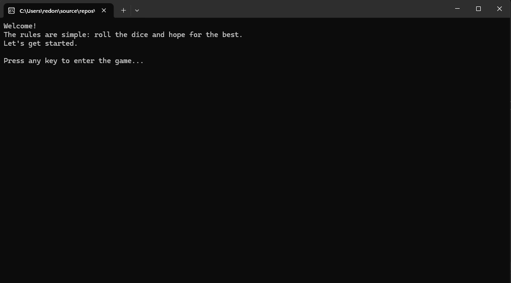

# 🎲 Roll the Dice

A simple console-based dice game written in C#, where you compete against a computer-controlled opponent over 10 rounds.



## How it works

Each round, both you and the enemy roll a six-sided die. Whoever rolls higher wins the round and earns a point. After 10 rounds, the player with the most points wins the game.

## Features

- Turn-based dice rolling against a CPU opponent
- ASCII-art dice faces rendered directly in the console
- A short "rolling" animation before each result is revealed
- Colored console output to highlight round and game outcomes
- Clean object-oriented structure (`Dice`, `Player`, `Game`, `DiceRenderer`) instead of one big procedural script

## Tech stack

- C# / .NET
- Console application (no external libraries)

## Getting started

**Requirements:** [.NET SDK](https://dotnet.microsoft.com/download) installed.

```bash
git clone https://github.com/Reggynald/Roll-the-Dice.git
cd Roll-the-Dice/"Roll the Dice"
dotnet run
